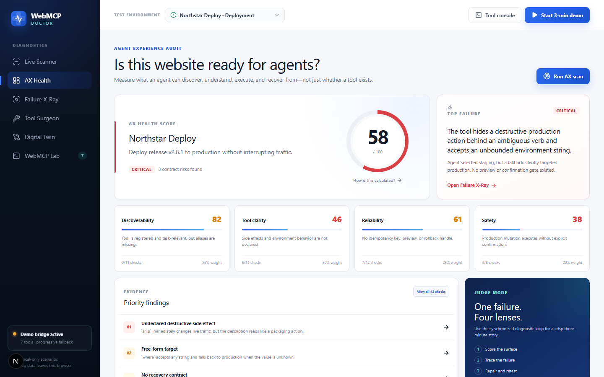

# WebMCP Doctor

**The agent-experience diagnostic lab for the web.** Audit whether agents can discover, understand, safely execute, and recover from a site’s WebMCP tools—not merely whether those tools exist.

**[Open the live Cloudflare demo](https://webmcp-doctor.otienomkeith.workers.dev)**



## Why it exists

Traditional web quality tools measure human-facing performance, accessibility, and SEO. WebMCP Doctor adds the missing agent-facing layer: **AX, or Agent Experience**.

It answers four questions:

1. Can an agent discover and select the right tool?
2. Does the contract communicate its real behavior and risk?
3. Can the agent retry, recover, or roll back safely?
4. Does the agent have the same capabilities the human UI exposes?

## The four wow factors

- **AX Health Score** — an explainable 42-check rubric across discoverability, clarity, reliability/recovery, and safety.
- **Agent Failure X-Ray** — a React Flow causal trace with clickable reasoning, payload, timing, and recovery evidence.
- **WebMCP Tool Surgeon** — unsafe/safe contract comparison, identical before/after tests, copy, and JSON export.
- **Human × Agent Digital Twin** — capability parity between the visible interface and the exposed agent workflow.

## Real scanning without a backend

Open **Live Scanner** to:

- self-scan the current page through `document.modelContext.getTools()`;
- audit the progressive registry mirror in browsers without WebMCP;
- paste a JSON tool array or `{ "tools": [] }` manifest;
- open a local `.json` manifest;
- inspect all 42 checks with evidence and remediation.

Manifest contents and audit results remain in the browser. There are no uploads, accounts, paid APIs, remote inference calls, or databases.

## Controlled demo environments

| Environment | Seeded defect |
| --- | --- |
| Northstar Deploy | Ambiguous production deployment with no preview or rollback |
| Nimbus Cloud | Credential rotation hides downstream dependencies |
| Mercury Market | `finalizeCart` silently places and charges an order |
| Orbit Workspace | Partial bulk-invite failure makes retries duplicate side effects |

Select **Start 3-min demo** for the recommended judge flow.

## Native WebMCP tools

The app registers seven meaningful tools with the current imperative WebMCP API:

- `scan_agent_experience`
- `inspect_tool`
- `trace_agent_failure`
- `compare_human_agent_paths`
- `simulate_tool_change`
- `run_ax_test`
- `explain_ax_score`

Every invocation returns structured JSON and synchronizes the visible interface. The WebMCP Lab includes native registration and registry-readback proof.

## Run locally

```bash
npm install
npm run dev
```

Open [http://localhost:3000](http://localhost:3000).

## Quality gates

```bash
npm run check       # lint + TypeScript + unit tests + production build
npm run test:e2e    # Playwright judge flow, scanner, and WebMCP round trip
```

The unit suite locks the 42-check rubric, unsafe/safe scoring behavior, manifest parsing, and untrusted-content checks. The end-to-end suite verifies the guided demo, manifest scanning, all 42 evidence rows, native registration, and agent-driven UI changes.

## Deploy to Cloudflare

```bash
npm run deploy
```

Next.js exports the application to `out/`; Wrangler deploys it as Cloudflare static assets. GitHub Actions run the full quality gate and can deploy `main` using `CLOUDFLARE_API_TOKEN` and `CLOUDFLARE_ACCOUNT_ID` repository secrets.

See [the architecture and data boundaries](docs/architecture.md).

## Stack

Next.js · TypeScript · Tailwind CSS · React Flow · Motion · Lucide · Vitest · Playwright · Cloudflare Static Assets

## License

[MIT](LICENSE)
