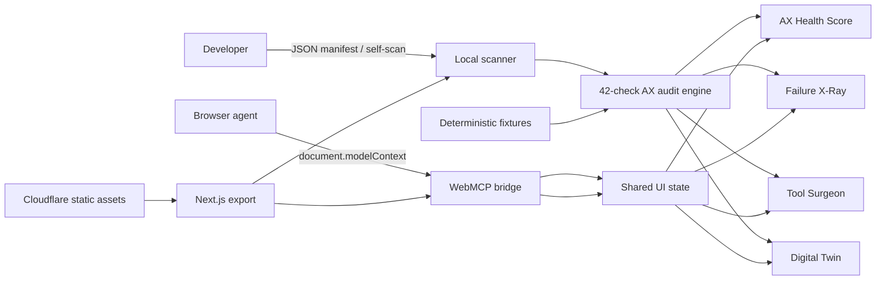

# Architecture

WebMCP Doctor is intentionally browser-first. The static application can inspect native page tools or imported JSON without transmitting a user’s schemas, tool metadata, or test results.

## Data boundaries

- Manifest parsing and scoring happen in the client.
- Native self-scan uses `document.modelContext.getTools()` when available.
- The fallback registry mirrors the same seven tools for browsers without WebMCP.
- Demo scenarios are static TypeScript data and produce repeatable results.
- There are no API keys, databases, remote inference calls, cookies, or analytics dependencies.

## Deployment

Next.js emits a static export into `out/`. Wrangler publishes that directory using Cloudflare Workers Static Assets. The project can add a Worker or D1 later without changing the current product boundary, but neither is needed for the hackathon build.
