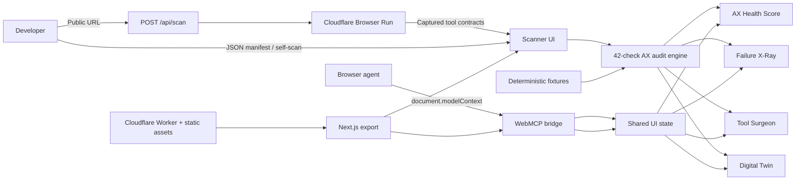

# Architecture

WebMCP Doctor is browser-first with one narrowly scoped edge endpoint. Public URL scans require a real browsing context because WebMCP tools are registered by page JavaScript and cannot be inspected across origins from the static dashboard.

## Data boundaries

- Manifest parsing and scoring happen in the client.
- Native self-scan uses `document.modelContext.getTools()` when available.
- Real-site scans send only the public target URL to `POST /api/scan`.
- The Worker renders the page, captures imperative registrations, reads native tools where supported, and converts declarative WebMCP forms into JSON Schema.
- Tools are never invoked. Private and local network targets are rejected before navigation and at the subrequest boundary.
- Successful real-site responses are cached for five minutes to conserve Browser Run allocation.
- The fallback registry mirrors the same seven tools for browsers without WebMCP.
- Demo scenarios are static TypeScript data and produce repeatable results.
- There are no API keys, databases, remote inference calls, cookies, or third-party analytics dependencies.

## Deployment

Next.js emits a static export into `out/`. Wrangler publishes that directory using Cloudflare Workers Static Assets. Static requests bypass Worker execution; `/api/*` is routed through `worker/index.ts`, which uses the `BROWSER` binding. No D1, KV, R2, or external service is required.
